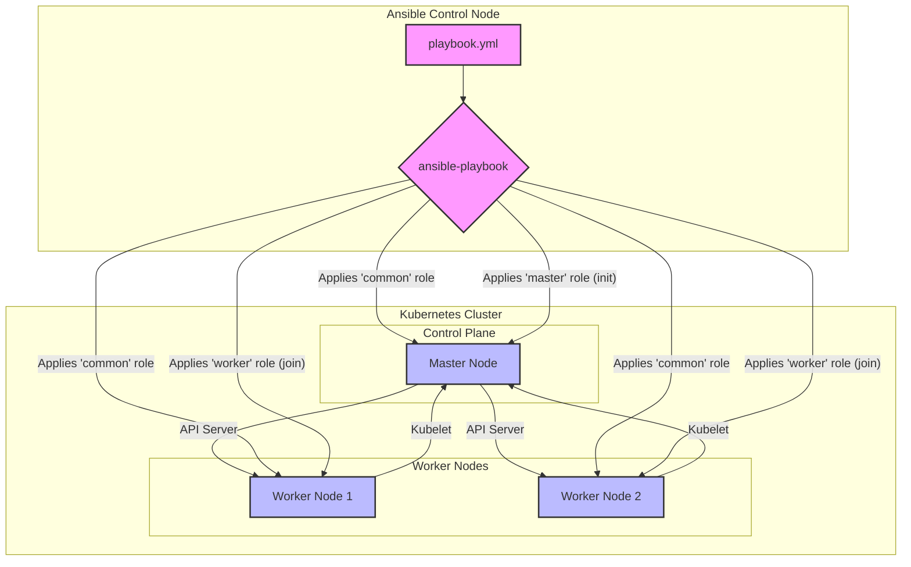

# Kubernetes on Ansible

This project provides a streamlined way to deploy a production-ready Kubernetes cluster on RHEL-based systems (e.g., CentOS, Rocky Linux) using Ansible. It's designed to be simple, idempotent, and easy to customize. It sets up a single control-plane node and multiple worker nodes, complete with networking and essential services.

## Architecture Diagram

The diagram below illustrates the architecture of the Kubernetes cluster deployed by this Ansible playbook.



## Features

- **Single-Master Cluster:** Deploys a single control-plane node for simplicity.
- **Firewall Configuration:** Automatically configures firewall rules for all nodes.
- **Container Runtime:** Installs and configures `containerd` as the container runtime.
- **CNI Plugin:** Deploys the Calico CNI for robust pod networking.
- **Idempotent:** The playbook can be run multiple times without causing issues.
- **Reset Playbook:** Includes a playbook to reset the cluster to a clean state.

## Requirements

- **Ansible:** Version 2.10 or newer installed on your control node.
- **Target Hosts:**
  - A RHEL-based Linux distribution (e.g., CentOS, Rocky Linux 8/9).
  - At least 2 CPU cores and 2GB RAM per node.
  - Passwordless SSH access from the Ansible control node to all target hosts (using SSH keys).
- **Python:** Python 3 on the Ansible control node, with the `jmespath` library installed (`pip install jmespath`).

## Setup & Configuration

1.  **Clone the repository:**

    ```bash
    git clone https://github.com/kofta999/k8s-on-ansible
    cd k8s-on-ansible
    ```

2.  **Install Ansible Dependencies:**
    This project uses external Ansible roles and collections. Install them using `ansible-galaxy`:

    ```bash
    ansible-galaxy install -r requirements.yml
    ```

3.  **Configure the Inventory:**
    Edit the `inventory.ini` file to match your environment. Add the IP addresses or hostnames of your master and worker nodes under the appropriate groups.

    ```ini
    [masters]
    192.168.122.10

    [workers]
    192.168.122.11
    192.168.122.12
    ```

4.  **(Optional) Customize Variables:**
    You can override default variables by creating a `group_vars/all.yml` file. Key variables include:
    - `k8s_version`: The Kubernetes version to install (e.g., `1.30`).
    - `tigera_operator_url`: The URL for the Tigera Operator manifest.
    - `custom_resources_url`: The URL for the Calico custom resources manifest.

## Usage

After completing the setup and configuration, run the main playbook to deploy the cluster:

```bash
ansible-playbook playbook.yml
```

Once the playbook completes, you can access your cluster from the master node. The `kubectl` configuration file will be located at `~/.kube/config` for the user that Ansible connected with.

### Verification

To verify that your cluster is running correctly, you can use the following commands on the master node:

- **Check node status:**

  ```bash
  kubectl get nodes
  ```

  You should see all your master and worker nodes with a `Ready` status.

- **Check pod status:**

  ```bash
  kubectl get pods --all-namespaces
  ```

  You should see pods for Calico, CoreDNS, and other system components in a `Running` state.

## Resetting the Cluster

This project includes a playbook to reset the cluster. This will remove all Kubernetes components and reset the nodes to their pre-deployment state.

**Warning:** This is a destructive operation and will result in the loss of all data on the cluster.

To run the reset playbook:

```bash
ansible-playbook reset.yml
```

## Troubleshooting

- **`kubelet` service fails to start:** This is often due to SELinux being in `enforcing` mode. The playbook sets it to `permissive`, but if you're having issues, you can manually set it on each node:

  ```bash
  sudo setenforce 0
  sudo sed -i 's/^SELINUX=enforcing$/SELINUX=permissive/' /etc/selinux/config
  ```

- **Nodes fail to join the cluster:** Ensure that the firewall rules are correctly applied and that there's network connectivity between the master and worker nodes.

## Project Structure

- `playbook.yml`: The main playbook that orchestrates the deployment.
- `reset.yml`: The playbook to reset the cluster.
- `inventory.ini`: The inventory file defining the master and worker nodes.
- `requirements.yml`: Ansible Galaxy dependencies.
- `roles/`: Contains the Ansible roles:
  - `common`: Base configuration for all nodes.
  - `master`: Sets up the Kubernetes control plane.
  - `worker`: Sets up and joins worker nodes to the cluster.

## License

This project is licensed under the MIT License. See the [LICENSE](LICENSE) file for details.

## Author Information

This project is maintained by [kofta999](https://github.com/kofta999). Contributions are welcome!
