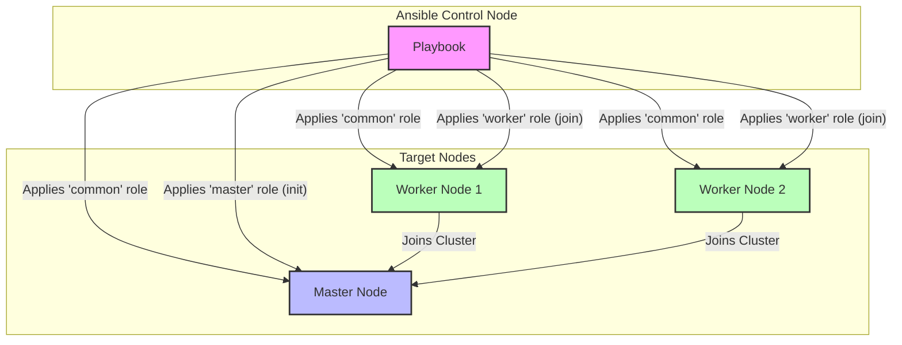

# Ansible Kubernetes Setup

This project uses Ansible to deploy a basic, production-ready Kubernetes cluster on RHEL-based systems (e.g., CentOS, Rocky Linux). It sets up a single control-plane node and multiple worker nodes.

## Architecture Diagram



## Features

- Deploys a single-master Kubernetes cluster.
- Configures firewall rules for all nodes.
- Installs `containerd` as the container runtime.
- Deploys the Calico CNI for pod networking.
- Idempotent playbook design.

## Requirements

- **Ansible:** Version 2.10 or newer.
- **Target Hosts:**
  - A RHEL-based Linux distribution (e.g., CentOS, Rocky Linux 8/9).
  - At least 2 CPU cores and 2GB RAM per node.
  - Passwordless SSH access from the Ansible control node to all target hosts (using SSH keys).
- **Python:** Python 3 on the Ansible control node.

## Setup & Configuration

1.  **Clone the repository:**

    ```bash
    git clone <your-repository-url>
    cd <repository-directory>
    ```

2.  **Install Ansible Dependencies:**
    This project uses external Ansible roles and collections. Install them using `ansible-galaxy`:

    ```bash
    ansible-galaxy install -r requirements.yml
    ```

3.  **Configure the Inventory:**
    Edit the `inventory.ini` file to match your environment. Add the IP addresses or hostnames of your master and worker nodes under the appropriate groups.

    ```ini
    [master]
    192.168.122.10

    [workers]
    192.168.122.11
    192.168.122.12
    ```

4.  **(Optional) Customize Variables:**
    You can override default variables by creating a `group_vars/all.yml` file. Key variables include:
    - `k8s_version`: The Kubernetes version to install (e.g., `1.35`).
    - `tigera_operator_url`: The URL for the Tigera Operator manifest.
    - `custom_resources_url`: The URL for the Calico custom resources manifest.

## Usage

After completing the setup and configuration, run the main playbook to deploy the cluster:

```bash
ansible-playbook playbook.yml
```

Once the playbook completes, you can access your cluster from the master node. The `kubectl` configuration file will be located at `~/.kube/config` for the user that Ansible connected with.

## Project Structure

- `playbook.yml`: The main playbook that orchestrates the deployment.
- `inventory.ini`: The inventory file defining the master and worker nodes.
- `requirements.yml`: Ansible Galaxy dependencies.
- `roles/`: Contains the Ansible roles:
  - `common`: Base configuration for all nodes.
  - `master`: Sets up the Kubernetes control plane.
  - `worker`: Sets up and joins worker nodes to the cluster.
